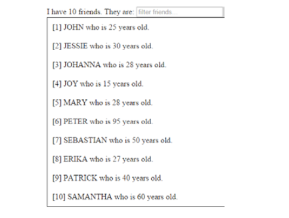

# Fundación Telefónica. Programación en JavaScript

## Módulo I. Páginas dinámicas

Aquí voy a desarrollar los contenidos de un pequeño curso JavaScript para seguir aprendiendo y practicando un poco con Atom editor, Markdown y GitHub.

Ayer ya realicé el primer módulo, consistente básicamente en las tres diferentes formas de incluir contenido JavaScript en un documento html:

La primera escribiendo el código entre las etiquetas `<script>` en la cabecera del documento:

```
<script type= "text/javascript">
  Alert("Un mensaje de prueba");
</script>
```
Otra, la más común, consiste en indexar los documentos que contienen JavaScript a través del atributo src:


```
<script type="text/javascript" src="/js/codigo.js"></script>
```

También hay la posibilidad de incluir JavaScript dentro de las propias etiquetas html, lo que no resulta muy práctico y hace que el documento html sea más complicado de leer:

```
<p onclick="alert('mensaje de prueba')">Párrafo en el texto.</p>
```

## Módulo II. Sintaxis del lenguaje JavaScript

Algunas de las características sintácticas de este lenguaje son las siguientes:

- No importan las nuevas líneas ni los espacios en blanco ya que al igual que ocurre con HTML, el propio intérprete del lenguaje las ignora

- Es case sensitive

- A diferencia de la mayoría de lenguajes de programación, no hay que definir el tipo de variable (var). Una misma variable puede contener diferentes tipos de datos.

- Cada sentencia acaba con el carácter punto y coma (;)

- Se puede incluir comentarios en el código para añadir información sobre lo que el script está haciendo:

`ejemplo de comentario de una línea:`

```
//aquí se muestra un mensaje
alert("mensaje de prueba");
```
`ahora vemos un ejemplo de comentario de varias líneas:`

```
/*Los comentarios de varias líneas
son muy útiles cuando hay que incluir una cantidad
de contenido considerable en el mensaje*/
```

## *Variables*

Sin las variables sería imposible escribir y crear "códigos genéricos", es decir, que funcionen de la misma manera independientente de los valores concretos usados. En JavaScript, se usan mediante la palabra reservada `var`

```
var num_1= 4;
var num_2= 6;
var res = num_1 + num_2;
```
Al nombre de la variable también se le conoce como identificador y debe cumplir la siguiente normativa:

- Sólo puede estar formado por números, letras o como mucho los valores `$` ó `_`

- El primer carácter no debe ser un número

## *Tipos de datos*

Ya sabemos que las variables en JavaScript se crean a partir de la palabra reservada `var`, pero dependiendo de la información que contenga será de un tipo u otro.

```
var entero = 99; // variable tipo entero
var sms = "Hola tronco!" // Variable tipo cadena de texto o string

var dias = ["Lunes", "Martes", "Miercoles", "Jueves", "Viernes"] // Variable tipo array

//Bucle para recorrer el array

for (var i = 0; i<dias.lenght;i++){
  alert(dias[i]);
}

var register = true;
var register = false; // Variables de tipo lógico o booleanos
```

## *Operadores*

Los operadores manipulan, realizan cálculos matemáticos o comparan  valores de diferentes variables. Estos son los diferentes tipos:

```
var num_1 = 3; //asignación

var num = 5;
++num;
alert(num); //num = 6. Aumentar o decrementar

// Operadores lógicos serán los adecuados para realizar condiciones y lógica matemática

Negación:
var vis = true;
alert(!vis); // a causa de la negación ! mostrará false en vez de true

Matemáticos:
/ = división
+ = sumar
- = restar
* = multiplicar

Relacionales:
>, <, // mayor que, menor que
>=, <= // mayor o igual que, menor o igual que
==, != // igual que, distinto de

Combinación:
and /*este operador combina diferentes variables dando true si la condición para ambos valores se cumple*/

or /*este operador combina diferentes variables dando true si la condición para alguno de los valores se cumple, de otro modo dará false*/
```
## *Document Object Mode (DOM)*

Cuando se carga una página en un navegador se crean un número de objetos característicos del navegador según el contenido de la página, con la siguiente jerarquía de clases:

**Estructuras**

**1 WINDOW OBJECT**
Contiene las propiedades básicas de la ventana y sus componentes:
- *Default status* contiene el mensaje que aparece en la barra de estado
- *Frames* es una matriz que representa todos los frames de la ventana
- *Lenght* nos indica el núm de frames de la ventana
- *Name* contiene el nombre de la ventana
- *Self* podríamos decir que también hace referencia a la propia ventana

**2 LOCATION OBJECT** Contiene toda la información sobre la url que se está visualizando y los detalles de esa dirección como puerto, protocolo, etc.

**3 SCREEN OBJECT** Permite obtener información sobre la resolución de la pantalla

**4 DOCUMENT OBJECT** Hace referencia a determinadas carácterísticas de la página (bg color, link color, etc)

**Navegación**

**1 HISTORY OBJECT** Se utiliza principalmente para generar botones de avance y retroceso

**2 NAVIGATOR OBJECT** Permite obtener información sobre el navegador con el que se está visualizando el documento.

## Módulo III. Control de flujo


Los códigos que se pueden escribir usando solo variables y operadores, son una sucesión de instrucciones básicas.

Hay programas complejos como recorrer un array o establecer una condición que no pueden ser realizadas simplemente con una sucesión de instrucciones básicas, es por ello que necesitamos instrucciones de control de flujo que nos permite elegir líneas para ejecutar dentro de nuestro código o repetir una serie de líneas un número de veces según una condición.

Son instrucciones del tipo:

"si se cumple esta condición, hazlo; si no se cumple, haz esto otro"

"repite esto mientras se cumpla esta condición".

Utilizar este tipo de estructuras de control de flujo, convierte a los programas en “inteligentes” permitiendo tomar decisiones en función del valor de las variables utilizadas.

## *Estructuras*

**Estructura if:**

`if(condición) {algoritmo}`

Cuando se comprueba el cumplimiento de la condición, el programa accede al algoritmo entre llaves para llevar a cabo la acción indicada. Si la condición no se cumple no se entrará en las llaves y el programa simplemente pasa a la siguiente instrucción.

**Estructura if else:**

```
if(condición) {algoritmo}
  else {algoritmo secundario}
```
A veces necesitamos que cuando se cumple una condición se ejecute un código, y si no se cumple se lleve a cabo otra acción. Para eso sirve el condicional adicional `else {}`. Se pueden añadir tantas condiciones como sea necesario añadiendo `else if {}` antes del último condicionante, que será simplemente `else {}`

  **Estructura for:**

  ```
  for (condición, instrucción, actualización)
    {algoritmo}
  ```

  Los bucles for permiten reiterar líneas de código mientras se satisfaga una condición.

  **Estructura for...in:**

  `for (indice in array){algoritmo}`

  Esta variante del bucle for nos permite usar un índice que recorra un array para realizar operaciones con cada uno de sus valores.
  También sirve para objetos dentro del lenguaje JavaScript.

  ## *Funciones*

  Para manejar nuestras diferentes variables JavaScript hace uso de funciones y propiedades, que ya se encuentran en el propio lenguaje. A continuación, veremos las funciones según su utilidad.


  **Funciones para cadenas de texto**


  - **Lenght** halla la longitud de una cadena de texto.
  - **+** se emplea para concatenar varias cadenas de texto.
  - **toUpperrCase()** convierte los caracteres a mayúsculas.
  - **toLowerCase()** convierte los caracteres a minúsculas.
  - **charAt(posición)** halla el carácter en una posición concreta de un array por ekemplo.
  - **indexOf(caracter)** halla la posición donde se encuentra un caracter indicado. Si no está devuelve `-1`, y si está más de una vez devolverá la primera posición en que lo encontró.
  - **lastIndexOf(caracter)** halla la última posición en la que se encuentra un carácter. Si no está devuelve `-1`
  - **substring(inoicio, final)** saca un trozo de una cadena de texto. El parámetro final no es obligatorio. Si no se indica, de forma automática recogerá hasta el final del string


  **Funciones útiles para arrays**

  - **Lenght** halla el núm de elementos de un array.
  - **concat()** concatena los elementos de varios arrays.
  - **join(separador)** une los elementos de un array para formar una cadena de texto.
  - **pop()** suprime el último elemento de un array y lo mete en la variable seleccionada.
  - **push()** agrega un elemento o varios a nuestro array.
  - **shift()** suprime el primer elemento de nuestro array y lo mete en la variable seleccionada.
  - **unshift()** agrega un elemento o varios al principio de nuestro array.
  - **reverse()** invierte el orden de los elementos de un array.


  **Funciones útiles para los números**

  - **Infinity** es el valor de infinito cuando las operaciones dan dicho resultado.
  - **toFixed(digitos)** define el número de decimales a mostrar en una operación y redondea si es necesario.    


  ## Módulo IV. Eventos y objetos

  ## *Eventos*


  Hasta el momento, todos los códigos que hemos visto siguen ejecutándose sentencia a sentencia, sin interactuar con el usuario.

  Estos códigos son poco útiles en programas de JavaScript normales ya que se espera y desea una interacción con los clientes que estén usando esa página web. Así, clickar con el botón del ratón en ciertos apartados, mover el mismo ratón, o teclear pueden ser eventos que se produzcan dentro de nuestra aplicación y se traduzcan en funciones que se tienen que ejecutar en ciertos momentos en JavaScript.

  El propio lenguaje nos aporta una serie de eventos para medir la interacción del usuario con nuestra aplicación. Estas funciones creadas en JavaScript son denominadas “manejadores de eventos” o “event handlers”.

  Hay tres tipos de manejadores de eventos:

  - Como atributos de las etiquetas HTML
  - Como funciones en código JavaScript externo
  - Semánticos

  

  ## *Objetos*

  Para trabajar objetos en programación vamos a utilizar JSON (JavaScript Object Notation) es un formato para el intercambio de datos por la red, donde usualmente se utilizaba XML.

  Es un conjunto de datos, comprendidos entre los que puede medir JavaScript que son objetos, Arrays, cadenas, booleanos y números en Javascript.

  Llegó sobre 2001 gracias al apoyo incondicional de Douglas Crockford. Yahoo! ayudó a su difusión gracias a la adición de este formato en algunos de sus servicios web más innovadores. Google comienza a realizar sus feeds en JSON para su protocolo web GData a finales del 2006.

  Es considerado como un lenguaje independiente de formato de los datos cuya especificación es descrita en RFC4627.

  ## Manejadores de eventos

  ## *Atributos HTML*

  Queda incluido en el mismo atributo:

  `<input type="button" value="pinchame" onclick="alert=('Gracias');"/>`

  Este método es poco práctico ya que dificulta la reutilización del código más allá del atributo en cuestión. Por cierto, lo que está haciendo el código de arriba es hacer que aparezca el mensaje Gracias cuando se clica en el botón pinchame.

  ## *Variable "this"*

  Esta variable es especial en JavaScript. Se usa para que tome como  valor el invocador del elemento dentro del manejador. Es decir, qué componente nos ha invocado la función:

  ```
  <div id="contenido" style="width:180px; height:80px; border: thin
   solid silver" onmouseover="this.style.borderColor='red';">
  Sección de contenidos...</div>
  ```
  En el caso anterior, el componente CSS style es tomado por la función onmouseover para cambiar el color del borde del elemento html `<div>`. Al pasar el ratón por encima de este elemento, el color del borde cambia de color gris a rojo.

  ## *Funciones externas*

  Es mucho mejor para nuestro código y para la reutilización de nuestras funciones tenerlas en sentencias externalizadas. Así podemos llamar a cualquier función desde cualquier manejador de eventos en cualquier momento.

  Por ejemplo, tenemos externalizada la función muestra, que básicamente muestra un mensaje de agradecimiento:

   `funcion(muestra){ alert('Gracias')}`

  Ahora la llamaremos desde el manejador de eventos `onclic` (al hacer click) desde el documento html al estar definiendo un botón:

  ```
  <input type="button" value="Pinchame" onclick="muestra()"/>
  ```
  ## *Eventos semánticos*

  Esta implementación del manejador se basa en la externalización del código JavaScript, seleccionando el componente al que queremos agregar un manejador de evento y desvinculando completamente nuestro código HTML del código JavaScript.

  ## Particularidades de JSON sobre JavaScript

  Algunas de las particularidades o reglas del formato JSON a tener en cuenta son:

  - Son duplas nombre-valor y los nombres van delimitados por comillas, tanto simples como dobles, aunque pueden aparecer sin ellas.
  - JSON puede representar los seis tipos de valores de JavaScript: objetos, Arrays, números, cadenas, booleanos y null.
  - Las fechas no son un tipo de objeto propio.
  - Los números no pueden ir precedidos de ceros a no ser en el caso de notación decimal (Ejemplo: 0.001).
  - JSON es considerado un lenguaje independiente
  - Sus objetos deben ser considerados como cadenas Javascript, no como objetos nativos.

  ## El estandard DOM

  DOM (Document Object Model) es un agregado de utilidades diseñadas para la manipulación de XML. Además, DOM también se usa para manipulación de documentos XHTML y HTML.

  DOM es una API de funciones que se pueden usar para la manipulación de las páginas XHTML de forma eficiente y rápida.

  Antes de usar las funciones, DOM convierte internamente el XML original en una estructura fácilmente manejable formada por una jerarquía de nodos. De esta manera, DOM transforma el XML en una serie de nodos interconectados en árbol.

  Ejemplo:

  ```
  !DOCTYPE html>
<html lang="es">
<head>
  <title>Página sencilla</title>
</head>
<body>
  <p> Esta página es <strong>muy sencilla</strong></p>
</body>
</html>
```

  El árbol que se genera no representa únicamente los contenidos del fichero origen (mediante los nodos del árbol) sino que representa sus relaciones (mediante las ramas del árbol que conectan los nodos).   

  

  ## Manipulación de un HTML con DOM JavaScript

  Una de las principales ventajas del uso del DOM es que permite a los desarrolladores web disponer de un control preciso sobre la estructura o forma del documento HTML o XML que están controlando. Las funciones que usa DOM permiten añadir, eliminar, modificar y reemplazar cualquier nodo de cualquier documento sencillamente.

  Los documentos XML y HTML son convertidos por DOM en una jerarquía de nodos. Los nodos pueden ser de diferentes tipos:
  - **Document** Es el nodo raíz de cualquier documento HTML y XML. Todos los demás salen de el.

  - **DocumentType** Nodo que contiene la representación del DTD empleado en la página (indicado mediante el DOCTYPE)

  - **Element** contenido definido por un par de etiquetas (o tags) de apertura y cierre `<etiqueta>...</etiqueta>` o de una etiqueta abreviada que se autocierra `<etiqueta/>`. Es el único nodo que puede tener tanto nodos hijos como atributos.

  - **Attr** Representa el par nombre de atributo - valor

  - **Text** Es el contenido del texto que se halla entre una etiqueta de apertura y una de cierre. También guarda el contenido de una sección de tipo CDATA.

  - **CDataSection** Nodo que muestra una sección tipo `<![CDATA[]]>`

  - **Comment** Un comentario de XML

  - **Otros menos usuales como** DocumentFragment, Entity, EntityReference, ProcessingInstruction y Notation.

  ## Selectores y DOM

  Una vez DOM ha formado automáticamente el árbol completo de nodos de la página, ya es posible usar sus funciones para obtener la información sobre los nodos o controlar su contenido:

  

  Y ahora ya podemos usar cualquier función o propiedad de DOM con nuestro JavaScript:

  

  ## Manejo del DOM ejercicios

  - Obtener la lista de elementos de etiqueta `<p>` y mostrarlos en  un alert de JavaScript.
  - Añadir un nuevo elemento `<p>` con el texto “Texto del nuevo párrafo” y que sea hijo del body


  Lo que hay que hacer es crear botones y aplicarles funciones para hacer que a través de código JavaScript se puedan manipular los elementos del DOM.

  En el documento HTML crearemos el botón y le asociaremos una función al evento "onclick":

  `<button onclick="miFuncion1()">Recopilar</button>`

  vamos a ver como sería esa función JavaScript.

  Creamos la variable párrafos con:
  ```
  var parrafos = document.getElementByTagName("p")
  ```
  para definir esta variable ya estamos usando dos elementos del DOM: **document**, que es el nodo raíz de cualquier documento HTML, y **element**, que hace referencia al contenido definido por un par de etiquetas (tags) de apertura y cierre.

  Lo siguiente será definir un bucle en el que un contenedor (i), haga una iteración por los diferentes párrafos y el contenido de cada posición sea mostrado a través de la variable **texto**, que será un string vacío. entonces tendríamos lo siguiente:

  ```
  function recopilar(){   
  var texto="";   
  var parrafos = document.getElementsByTagName("p");   
  for(var i=0;i<parrafos.length;i++){   
  texto+=parrafos.item(i).innerText+", ";   
  };   
  ```
  Así hacemos que la variable **texto** sea igual al texto contenido entre las etiquetas `<p>`(innerText, otro elemento del DOM), que a su vez es contenido en la variable parrafos a través del iterador (i). Ahora hay que sacarlo por la pantalla:

  ```
  function recopilar(){
    var texto="";
    var parrafos = document.getElementsByTagName("p");
    console.log(parrafos);
    for(var i=0;i<parrafos.length;i++){
      texto+=parrafos.item(i).innerText+", ";
    };
    texto=texto.slice(0, -2)+".";//cambia la última coma por punto
    alert(texto);
  }
  ```
  Con el método slice el resultado queda ya bien presentado.

  Para el segundo caso lo que haremos será la siguiente función:

  ```
  function nuevoParrafo(){
		var nuevotexto = document.createElement("p");
		nuevotexto.innerHTML = "Texto del nuevo párrafo";
		document.body.appendChild(nuevotexto);
	}
  ```
  Al estar añadiendo nuevos elementos HTML al documento usaremos innerHTML en vez de innerText.

  Con `document.body.appendChild` añadimos un nuevo nodo a la sección body

  Aquí dejo el [enlace](https://altocodigo.blogspot.com/2019/07/manejar-el-dom-en-javascript.html) que me ha ayudado a desarrollar y comprender el ejercicio

  ## MODULO V. Ajax y Jquery

  ## *AJAX*

  Se presentó por vez primera en el artículo "Ajax: A New Approach to Web Applications" de Jesse James Garrett en 2005. Anteriormente no existía un término que hiciera referencia a un tipo nuevo de programación web que estaba surgiendo.

  Realmente, el término AJAX es un acrónimo (Asynchronous JavaScript + XML).

  El artículo define AJAX de la siguiente forma:

  **"Ajax no es una tecnología en si mismo. En realidad, se trata de varias tecnologías independientes que se unen de formas nuevas y sorprendentes"**

  ## *JQUERY*

  Es una librería JavaScript que nos permite acceder a los objetos del DOM de manera simple creada por John Resig (Mozilla).

  Como los desarrollos web son cada vez más complejos, con funcionalidades de autocompletar, drag & drop, validaciones y un largo etcétera; se necesitan algunas herramientas que no nos las hagan desarrollar desde cero.

  Esto son las librerías de terceros, entre ellas JQuery, que están hechas para simplificar y aclarar nuestro código JavaScript. Adicionalmente nos suelen resolver los problemas de códigos que funcionen de manera diferente en distintos navegadores.

  *Ventajas*

  - Ahorra muchas líneas de código
  - Transparenta el soporte de nuestra aplicación para los principales navegadores
  - Provee un mecanismo para capturar los Eventos


  *Desventajas*

  - Probee un conglomerado de funciones para hacer animaciones en la página de una manera muy simple.
  - Integra funcionalidades para trabajar con Ajax


  *Las desventajas parecen también ventajas, pero bueno ya se verá...xd

## **Ajax: tecnologías implicadas y funcionamiento**

**Tecnologías**

El desarrollo de aplicaciones AJAX requiere un conocimiento avanzado de todas y cada una de las tecnologías y componentes siguientes:

- XHTML y CSS, crea una presentación basada en estándares.
- XMLHttpRequest, es el objeto encargado del intercambio asíncrono de información
- DOM, para la manipulación e interacción dimámica de la capa de presentación.
- XML, XSLT y JSON, son las tecnologías que constituyen el intercambio y la manipulación de información.
- JavaScript, como unión de todas las tecnologías.


**Funcionamiento**

En los antiguos desarrollos web, acciones que realice nuestro cliente sobre la página desencadenaban llamadas al servidor. Y una vez el servidor hubiera acabado con ese tráfico de información devolvía y, por tanto, recargaba, la página web en nuestro cliente.

Veamos como es este proceso en Ajax:


## Ajax: peticiones y respuestas

*El objeto XMLHttpRequest*

- **Objetivo:** realizar peticiones asíncronas al servidor
- Es la columna vertebral de todos los desarrollos con AJAX
- Aceptado por todos los clientes web (Microsoft lo mete en IE 5 como un  objeto ActiveX)


*Propiedades del objeto XMLHTTPRequest*


## Casos prácticos AJAX

A continuación te proponemos unos casos prácticos, leelos con atención y desarrolla la actividad presentada. Así podrás practicar todo lo aprendido.

*Bueno cabe decir que no se provee de ningún resultado correcto para contrastar la actividad, hay que espabilarse con lo que se explica en el curso y ya está...veré que puedo hacer xd*

**JSON**


Hay que hacer un objeto JSON que permitiera en caso necesario, acceder a la información de los contactos almacenada en él, supongo...

voy a poner aquí el código y cuando crea que está bien buscaré una forma de probarlo en local con XAMPP

```
{
    "objectid": "Phonebook",
    "owner": "Alejandro",
    "contacts": [
        {
            "objectid": "contact-info",
            "phone": "",
            "name": "",
            "title": "",
            "age": "",
            "adress": [
                {
                    "objectid": "adress-info",
                    "street": "",
                    "city": "",
                    "state": ""
                }
            ]
        }
    ]
}
```

Bueno tendría que crear un documento html que contuviera diversos campos sobre los que recopilar información a partir del fichero JSON.
Cada campo HTML tendrá un identificador igual al del fichero JSON para el mismo campo.

Por último habría que crear una función JavaScript que obtenga la información del registro completo desde el HTML, haciendo una llamada al objeto Phonebook por ejemplo y volcando la info del JSON al HTML.  

Si tuviéramos diferentes contactos con informaciones diferentes, habría que pasarle a la función al parámetro del nombre del contacto por ejemplo, para que mostrase en los campos del HTML la información correcta.

**REALIZACIÓN DE PETICIÓN AJAX A UN XML**

Teniendo el archivo XML cuyo nombre es ejemploXML.xml y con este
contenido: Hola que tal

Realizar un formulario con un texto y un botón de submit que cuando
se envíe una petición por Ajax al servidor obtenga el contenido de
este XML y lo ponga en el campo de texto.

Bueno para resolver esto podríamos tener algo como un documento HTML asi (obtenido del pdf del curso):

```
<!DOCTYPE html>
<html>
<head>
<script>
function loadXMLDoc()
{
  var xmlhttp;
  if (window.XMLHttpRequest)
  {// code for IE7+, Firefox, Chrome, Opera, Safari
    xmlhttp=new XMLHttpRequest();
  }
  else
  {// code for IE6, IE5
    xmlhttp=new ActiveXObject(“Microsoft.XMLHTTP”);
  }

xmlhttp.onreadystatechange=function()
{
  if (xmlhttp.readyState==4 && xmlhttp.status==200)
  {
    document.getElementById(“myDiv”).innerHTML=xmlhttp.responseXML;
  }
}

xmlhttp.open(“GET”,”ejemploXML.xml”,true);
xmlhttp.send();
}
</script>
</head>
<body>
<div id=”myDiv”><h2>Let AJAX change this text</h2></div>
<button type=”button” onclick=”loadXMLDoc()”>Change Content</button>
</body>
</html>
```

**Analizando el código:**

El texto que debe ser sustituido por lo que hay en el fichero XML.text lo encontramos en la línea :

`<div id=”myDiv”><h2>Let AJAX change this text</h2></div>`

Partiendo de esto, los pasos son los siguientes:

1 - El botón de mi html `<button type=”button” onclick=”loadXMLDoc()”>Change Content</button>`
lanza con el evento click la función loadXMLDoc(), la cual crea una variable llamada xmlhttp.

2 - El primer condicional nos sirve para saber si nuestro navegador
actual puede crear el objeto XMLHttpRequest que dependiendo
del navegador lo creará de una manera u otra:
```
function loadXMLDoc()
{
var xmlhttp;
if (window.XMLHttpRequest)
{// code for IE7+, Firefox, Chrome, Opera, Safari
xmlhttp=new XMLHttpRequest();
}
else
{// code for IE6, IE5
xmlhttp=new ActiveXObject(“Microsoft.XMLHTTP”);
}
```

3 - Abrimos la comunicación GET para pedir el fichero ajax.txt y
enviamos la petición (se puede enviar tanto asíncrona como
síncronamente dependiendo del valor del booleano):

```
xmlhttp.open(“GET”,”ajax.txt”,true);
xmlhttp.send();
```

4 - La función onreadystatechange() se ejecutará a cada cambio
de estado y cuando la petición sea de 200 y el readystate de 4
significará que se ha completado con éxito (con cualquier otra
solución debemos tratar el error o los errores que hemos visto en
las tablas anteriores):

5 - Finalmente seleccionamos el div en cuestión (a partir del API del
DOM) y cambiamos su texto plano por el que me ha venido en mi
fichero ajax.txt:
```
xmlhttp.onreadystatechange=function()
{
  if (xmlhttp.readyState==4 && xmlhttp.status==200)
  {
    document.getElementById(“myDiv”).innerHTML=xmlhttp.responseXML;
  }
}
```
 *Nota importante:*

En el ejemplo del curso se sustituye el texto del HTML por el de un fichero `.txt`, pero en el caso práctico hay que sustituirlo por el de un fichero XML (ejemploXML.xml), así que usamos la propiedad `XMLHttpRequest.responseXML` en lugar de `XMLHttpRequest.responseText` en la linea: `document.getElementById(“myDiv”).innerHTML=xmlhttp.responseXML;`


**TRANSFORMACIONES CON JSON**

Douglas Crawford nos dio la posibilidad de transformar un fichero
JSON a String y viceversa.

Use las funciones que este genio implementó con un objeto JSON
que contenga al menos otro objeto y un array de objetos como
propiedades. Muestre por consola el resultado de transformarlo a
String y vuelva a transformar ese String a objeto comprobando que
mantiene todas sus propiedades.

Bueno he desarrollado este caso de forma muy básica y sencilla simplemente para mostrar la funcionalidad de `JSON.parse()` y `JSON.stringify()`:

Partiendo del documento html:
```
<!DOCTYPE html>
<html lang=en>
<head>
    <meta charset= "utf-8">
    <tittle>Practico Ajax</tittle>
</head>

<body>

<div id="info"></div>

<script type="text/javascript">

  var objetoJSON =
  {
    "nombre": "Alejandro",
    "apellidos": "M L",
    "Edad": "45"
  }
  document.write(typeof objetoJSON);


  var cadenaJSON = '{"nombre": "Alejandro", "apellidos": "M L", "Edad": "45"}'
  document.write(typeof cadenaJSON);

  var personaJSON = JSON.parse(cadenaJSON);
  document.write(typeof personaJSON);

  var stringJSON = JSON.stringify(personaJSON);
  document.write(typeof stringJSON);

</script>

</body>
</html>
```

**Analizando el código:**

Como se aprecia, partimos de un objeto JSON guardado en la variable `objetoJSON` .Convertimos el objeto en cadena escribiendo el contenido de la misma variable en una misma línea y añadiendo una comilla simple al principio y otra al final. A la nueva variable la llamamos `cadenaJSON`.

Para comprobar que a la primera se considera un objeto y la segunda una cadena por parte del navegador, usamos la función `document.write(typeof [variable1/variable2])`

Lo siguiente que hacemos es pasar de cadena a objeto y de nuevo de objeto a cadena usando las funciones `JSON.parse()` y `JSON.stringify()` anteriormente mencionadas.

Si cargamos el documento tal cual lo tenemos aqui, sin comentar ninguna línea, nos va a decir:

`objectstringobjectstring`

Dejo el [enlace](https://www.youtube.com/watch?v=gYqEzjHDTWI) al estupendo vídeo de youtube que muestra el ejemplo.

## *Maneras de desarrollar con JQuery*

En las librerías de terceros (como en muchas otras materias) debemos adaptarnos a sus mecanismos de uso ya que intentar desarrollar como lo hacemos habitualmente podría hacer que nuestro código no tuviera el nivel que fuera de esperar.

Lo adecuado sería ir viendo cual es la mecánica al trabajar con dicha librería mediante problemas sencillos e ir complicándolo a medida que entendemos la propia librería.

**JQUERY: SELECTORES**

- **id**
- **clases**
- **selectores anidados. Ej:**

  `var a = $("div.redondeado");` Este selector seleccionaría una clase o más, y dentro de las mismas aquellos elementos que pertenecen a la clase *redondeado*

- **agrupación de selsctores. Ej:**

  `var a = $("#uno,div,div.redondeado");` Esta es la sintaxis para agrupar en una misma variable diferentes elementos por **id** y también por **clase** o simplemente por **tipo de elemento**

**JQUERY: FUNCIONES PRINCIPALES**

Con estas funciones podemos manipular elementos del DOM y tratar eventos en nuestras selecciones, vamos a ello.

- **text()** extrae el texto plano contenido entre los elementos seleccionados
- **text(valor)** reemplaza el texto plano con lo que hayamos pasado como valor
- **attr(nombre propiedad)** obtiene el valor de un atributo para nuestra selección
- **attr(nombre propiedad, valor)** modifica el atributo con el nuevo valor dentro de nuestra selección
- **removeAttr(nombre propiedad)** elimina el atributo de nuestra selección
- **addClass(valor)** añade la clase que hemos pasado en valor a nuestra selección
- **removeClass(valor)** la elimina
- **html()** obtiene html contenido dentro de nuestra selección
- **html(valor)** sustituye el html de nuestra selección por el nuevo html que le pasamos por valor
- **show()/hide()** muestra u oculta nuestra selección por el navegador
- **fadein()/fadeout()** igual que las anteriores pero de forma paulatina
- **toggle** cambia nuestra selección de visible a invisible y viceversa
- **each** iteración por los elementos de un array que implementa JQuery


**FUNCIONES PARA MANIPULACIÓN DEL DOM**

- **empty()** vacía de contenido nuestra selección
- **append(valor)** añade un componente o html que pasamos por parámetro al final de nuestra selección, justo antes de la etiqueta de cierre.
- **prepend(valor)** igual que la anterior pero ubica el valor pasado como parámetro justo después de la etiqueta de apertura
- **remove()** elimina la selección de nuestro mapa documental
- **eq(valor)** selecciona un componente de nuestra selección pasándole como parámetro la posición que ocupa en el array

**TRATAMIENTO DE EVENTOS CON JQUERY - Añadir funcionalidad a las selecciones**

- **click()** escucha de evento click del mouse. Se le puede pasar como parámetro la función que queremos que se ejecute cuando ocurra el evento.
- **dblclick()** igual que la anterior pero para doble click
- **mouseover()/mouseout()** al entrar y salir de la zona de nuestra sellección con el ratón, respectivamente
- **hover(mouseover(),mouseout())** define los dos comportamientos anteriores para un único evento (hover)
- **mousemove()** al moverse el ratón
- **Mousedown()/mouseup()** la acción que se ejecute dura lo mismo que la presión sobre el botón del ratón, y finaliza al soltar el botón.
- **focus()/blur()** actúa cuando se gana o se pierde el foco, respectivamente

## Casos prácticos Jquery

1 - Construir un HTML con dos `<input>` que implementen los eventos
de “tomar foco” y “perder foco” cuya funcionalidad sería cambiar
el estilo del texto de dichos elementos a un color rojo

Bueno para este ejercicio lo he hecho sólo con un input, porque de haber sido 2 se me complicaba la cosa ya que debía haber implementado control de flujo o condicionales usando identificadores por ejemplo, pero como no domino la sintaxis todavía pues lo dejo así:

```
<!DOCTYPE html>
<html lang="es">
<head>
  <meta charset="utf-8">
  <title>Formularios</title>
  <script src="jquery-3.7.1.min.js"></script>
  <script>
  $(document).ready(function()
  {
    $("input").focus(function()
    {
      $("input").css("color", "red");
    });
    $("input").blur(function()
    {
      $("input").css("color", "black");
    });
  });
    	</script>
</head>
<body>
  <section>
      <p><input id="focus" type="text" value="TEXTO A CAMBIAR DE COLOR"></p></br>
  </section>
</body>
</html>
```

De esta manera sencilla cuando se pulsa en el recuadro de texto el mismo cambia de color, y cuando se pulsa fuera vuelve a su color original.

Importante tener descargado el fichero JQuery en el mismo directorio que nuestro documento html e indexado correctamente para que funcione:

`<script src="jquery-3.7.1.min.js"></script>`


2 - Construir un HTML con varios <p> y un js que lea estas etiquetas.
El js resaltará de amarillo aquellos párrafos cuyo contenido sea
mayor de 100 caracteres.

Bueno amiguis, no nos vamos a engañar: he realizado este ejercicio con Chat GPT, pero bueno lo importante es que lo entiendo aunque podría practicar a ver si soy capaz de escribir el código yo solo:

```
<html lang="es">
<head>
  <meta charset="utf-8">
  <title>Formularios</title>
  <style>
  .highlight {
    background-color: yellow;
  }
  </style>
  <script src="jquery-3.7.1.min.js"></script>
  <script>
    	$(document).ready(function() {
  	       // Seleccionar todos los elementos <p>
  		     $('p').each(function()
           {
    			         // Verificar si la longitud del contenido del párrafo es mayor a 100 caracteres
    			         if ($(this).text().length > 100)
                   {
      				           // Si es mayor a 100 caracteres, agregar la clase de resaltado
      				           $(this).addClass('highlight');
    			         }
  		     });
	    });

    </script>
  </head>
  <body>
  <p>Este es un párrafo corto.</p>
  <p>Este es un párrafo un poco más largo que el primero.</p>
  <p>Este es un párrafo con un contenido mayor a 100 caracteres. Lorem ipsum dolor sit amet, consectetur adipiscing elit. Nulla nec purus auctor, mattis nisl nec, pulvinar ex.</p>
  <p>Este es otro párrafo con contenido extenso. Lorem ipsum dolor sit amet, consectetur adipiscing elit. Sed id tortor id dui luctus pharetra. Nam porttitor, felis at dapibus euismod, eros sem ullamcorper ipsum, quis aliquam enim ex vel eros. Sed consequat risus non nunc placerat, ac vehicula nisi sollicitudin.</p>
</body>
</html>
```

Lo que hacemos es crear la regla CSS para clase primero, y utilizar JQuery para añadir añadir dicha clase al elemento `<p>` que toque, en función de su longitud:

```
if ($(this).text().length > 100)
{
      // Si es mayor a 100 caracteres, agregar la clase de resaltado
      $(this).addClass('highlight');
}
```


## **Módulo VI. AngularJS y NodeJS**

## *AngularJS*

Nos encontramos ante un framework JavaScript de código abierto que se denomina AngularJS, que está siendo respaldado por Google, y ayuda con la construcción de las Single Page Applications o aplicaciones de una sola página.

El patrón Single Page Applications define que podemos construir o desarrollar aplicaciones web en una única página html, teniendo todo el ciclo de vida seleccionado en dicha página, y variando los componentes y controles con códigos JavaScript y las librerías o frameworks como AngularJS.

## *NodeJS*

Las primeras evoluciones de JavaScript vivían en los navegadores. Pero esto es sólo un contexto. Debemos tener claro que JavaScript es un lenguaje "completo": Se utiliza en muchos otros contextos. Node.js realmente es sólo otro contexto: te permite ejecutar e interpretar código JavaScript en el backend, es decir, fuera del navegador.

Para utilizar el código JavaScript en el backend, éste necesita ser interpretado y, bueno, ejecutado. Esto es lo que Node.js hace, con el uso de la Máquina Virtual V8 de Google, el mismo entorno de ejecución para JavaScript que el navegador Google Chrome.

**ANGULARJS: Principios de funcionamiento y elementos básicos**

AngularJS revisa el HTML que puede contener atributos de las etiquetas personalizadas adicionales (de la propia librería), obedece a las directivas de los atributos personalizados, y une los elementos de entrada o salida del documento a un modelo representado por las variables de JavaScript.


**Directivas**

Las directivas son atributos que se incluyen dentro de las etiquetas de nuestro código HTML para conectar la librería AngularJS con esos componentes que existen en nuestro mapa documental. Directivas hay muchas, por ejemplo:

- **ng-app** Auto arranca una aplicación Angular, nos selecciona el elemento raíz y se sitúa como atributo dentro de la etiqueta que deseas que sea la raíz de la aplicación. Se declara tal como sigue:

  `<html ng-app>`

- **ng-controller** Directiva que se usa para los controladores:
  ```
  <body>
    <div ng-controller=”nombre_de_controlador”>
      <h1>Hola </h1>
    <div/>
  </body>
  ```


**Controladores**

Los controladores en AngularJS son los encargados de controlar los datos de las aplicaciones AngularJS. Los controladores son objetos de JavaScript.

Las aplicaciones AngularJS son controladas por los controladores.
Un controlador no es más que un objeto JavaScript, que se crea con
el constructor de objetos de JavaScript. El ámbito de la aplicación
está definido por `$scope` y se corresponde con el elemento HTML
asociado a la aplicación. Ejemplo:
```
<div ng-app="" ng-controller="cochesController">
  Marca: <input type="text" ng-model="coche.marca"></br>
  Modelo: <input type="text" ng-model="coche.modelo"></br>
  El coche es:{{coche.marca + " " + coche.modelo}}
</div>
<script>
  function cochesController($scope)
  {
    $scope.coche =
    {
      marca: "Audi",
      modelo: "A5"
    };
  }
</script>
  ```

*Analizando el código:*

la aplicación AngularJS está definida por la directiva ng-app. La aplicación corre dentro de elemento `<div>`

La directiva ng-controller indica el nombre del objeto correspondiente al controlador. La función cocheController es el constructor estándar del objeto JavaScript.

El objeto controlador tiene una propiedad: `$scope.coche`. El objeto coche tiene dos propiedades: marca y modelo.

La directiva ng-model enlaza los campos `<input/>` a las propiedades del controlador (marca y modelo).

**Módulos**

Tus aplicaciones en AngularJS estarán compuestas por módulos. Todos los controladores de AngularJS deben pertenecer a un módulo. Con el uso de módulos mantenemos nuestro código limpio y bien organizado.

Esto se hace así para que entre otras cosas, los controladores no ensucien el ámbito global de JavaScript. Además, en los ejemplos que hemos ido viendo se han usado funciones globales. Esto no está bien.

Las variables globales y las funciones globales no se deben usar en las aplicaciones de AngularJS, ya que podrán ser sobrescritos o eliminados por otros scripts.

Para corregir este problema, en AngularJS hacemos uso de los módulos
Aquí un ejemplo usando un controlador simple:

```
<!DOCTYPE html>
< html >
< head >
  < script src = “//ajax.googleapis.com/ajax/libs/angularjs/1.2.15/angular.min.js” ></script >
</ head >
< body >
  < div ng-app = “miAplicacion” ng-controller = “miControlador” >
    {{ nombre + “ “ + apellidos }}
  </ div >
<script >
  var app = angular.module( “miAplicacion” , []);
  app.controller( “miControlador” , function ($scope) {
    $scope.nombre = “Mario”;
    $scope.apellidos = “Flores”;
    });
</ script >
</ body >
</ html >
```

**Casos Prácticos: AngularJS:**

*Nuestra primera aplicación con Angular*

Realizar una aplicación que muestre por pantalla, mediante
directivas de Angular, la siguiente imagen:



Debemos ser capaces de filtrar estos datos mediante el input
superior.

Aparte, los datos serán guardados en un array de objetos JSON
óptimo para dicha funcionalidad.

Bueno pues aquí está el ejercicio con la inestimable ayuda de Chat GPT y mis sugerencias para ir mejorando y simplificando el código:

```
<!DOCTYPE html>
<html lang="en" ng-app="myApp">
<head>
  <meta charset="UTF-8">
  <title>Sugerencias con AngularJS (Filtrado por Número)</title>
  <script src="https://ajax.googleapis.com/ajax/libs/angularjs/1.8.2/angular.min.js"></script>


  </script>
  <style>
  /* Estilos para la lista */
  .friends-list {
    /*border: 1px solid black; Borde negro de 1px alrededor de la lista de amigos */
    padding: 5px; /* Espacio interno */
    display: inline-block; /* Hace que el contenedor se ajuste al contenido */
    margin-top:10px;/* separación entre caja de texto y lista*/
    }
  }

  .friend-item {
  margin-bottom: 5px; /* Espacio entre elementos de la lista */
  }
  </style>
</head>
<body>

<div ng-controller="MainController">
  Tengo 10 amigos, que son: <input type="text" ng-model="selectedNumber" placeholder="Filtrar amigos..."></br>
  <div class="friends-list">
    <div ng-repeat="item in filteredData" class="friend-item">{{ '[' + item.number + '] ' + item.name + ' que tiene ' + item.age + ' años' }}</div>
  </div>
</div>

<script>
angular.module('myApp', [])
  .controller('MainController', ['$scope', function($scope) {
    $scope.data = [
        { number: 1, name: 'John', age: 25 },
        { number: 2, name: 'Alice', age: 30 },
        { number: 3, name: 'Bob', age: 35 },
        { number: 4, name: 'Carol', age: 40 },
        { number: 5, name: 'Tom', age: 45 },
        { number: 6, name: 'Eve', age: 50 },
        { number: 7, name: 'ChatGPT', age: 2 },
        { number: 8, name: 'Grace', age: 60 },
        { number: 9, name: 'Helen', age: 65 },
        { number: 10, name: 'Alfred', age: 70 }
      ];

      $scope.$watch('selectedNumber', function(newValue, oldValue)
      {
        $scope.filteredData = $scope.data;

        if (newValue !== oldValue)
        {
          if (newValue !== '')
          {
              // Filtrar los datos si el número introducido es válido
              $scope.filteredData = $scope.data.filter(function(item)
              {
                  return item.number.toString() === newValue;
              });
          }
        }
      });
    }]);
</script>

</body>
</html>
```

*Analizando el código*

**Directivas AngularJS usadas**

- **ng-app** Está inicializada en la raíz del documento HTML: `<html lang="en" ng-app="myApp">` Se utiliza en el elemento raíz del HTML para indicar a AngularJS qué parte de la página debe controlar.

- **ng-controller** Está en el elemento HTML donde la aplicación debe ejecutarse, en este caso el primer elemento div (padre) del documento:
```
<body>
<div ng-controller="MainController">
```
Se utiliza en elementos HTML para establecer el controlador que se aplicará a ese elemento y sus descendientes.

- **ng-model** Se encuentra como propiedad del input text o caja de texto para vincular su valor al modelo de datos del controlador, que será el objeto JSON que contiene la información:
`<input type="text" ng-model="selectedNumber" placeholder="Filtrar amigos..."></br>`

- **ng-repeat** En este caso, ng-repeat se aplica a un elemento HTML para repetir su contenido para cada elemento en la lista de amigos filtrados:

```
  <div ng-repeat="item in filteredData" class="friend-item">{{ '[' + item.number + '] ' + item.name + ' que tiene ' + item.age + ' años' }}</div>
```
`{{}}` Esta es una expresión de interpolación de AngularJS que se utiliza para insertar valores de variables o expresiones JavaScript en el HTML. En este caso, estamos concatenando cadenas de texto y variables **(item.number, item.name y item.age)** para formar una cadena que representa la información del amigo en el formato deseado.

Esto es una de las cosas poderosas de AngularJS: la capacidad de combinar HTML y JavaScript de manera declarativa para crear interfaces de usuario dinámicas.

**Lo que ocurre al introducir un valor en la caja de texto:**

```
$scope.$watch('selectedNumber', function(newValue, oldValue)
{
  $scope.filteredData = $scope.data;

  if (newValue !== oldValue)
  {
    if (newValue !== '')
    {
        // Filtrar los datos si el número introducido es válido
        $scope.filteredData = $scope.data.filter(function(item)
        {
            return item.number.toString() === newValue;
        });
    }
  }
});

```

AngularJS registra un observador en la propiedad **$scope.selectedNumber (asociada a la directiva ng-model, que es el cuadro de texto)** a través del método **$watch**. Esto significa que AngularJS supervisará cualquier cambio que ocurra en esta propiedad y ejecutará la función de devolución de llamada **(function(newValue, oldValue))** proporcionada cuando se detecte un cambio.

Esta función de devolución de llamada recibe dos parámetros: **newValue y oldValue**. newValue es el nuevo valor de la propiedad observada, mientras que oldValue es el valor anterior de la propiedad antes del cambio.

Dentro de la función de devolución de llamada, comparamos **newValue con oldValue** para determinar si ha ocurrido un cambio en la propiedad **$scope.selectedNumber**. Si newValue es diferente de oldValue, ejecutamos la siguiente lógica:

-  Tras comprobar que tampoco es una cadena vacía, utilizamos el método **filter()** en la matriz $scope.data para filtrar solo los elementos cuyo número coincida con el nuevo valor de **$scope.selectedNumber**. Esto nos da un nuevo conjunto de datos filtrados que coinciden con el número seleccionado.

- Asignamos este conjunto filtrado de datos a la propiedad **$scope.filteredData**, lo que actualiza la vista para mostrar solo los amigos cuyo número coincide con el número seleccionado.

Si **newValue** es igual a ' ' (es decir, si el nuevo valor es una cadena vacía), **$scope.filteredData** seguirá siendo igual a **$scope.data**, ya que se asignó inicialmente fuera del bloque condicional

## **NODEJS: Creación de un servidor HTTP**

Aunque más adelante hablaremos de la introducción de módulos en NodeJS, es necesario abordar un primer módulo imprescindible para la creación de un servidor de HTTP. Este es el módulo http.

Las interfaces HTTP en Node están diseñadas para soportar muchas de las características del protocolo que tradicionalmente han sido difíciles de usar. En particular, los mensajes grandes, seguramente fragmentado. La interfaz se asegura de que las peticiones o respuestas nunca se almacenen completamente en un búfer--se permite al usuario hacer stream de datos. Las cabeceras de los mensajes HTTP se representan por un objeto como este:

`{'content-lenght:'123','content-type':'text/plain','connection':'keep-alive', 'accept':'/'}`

Para soportar el espectro completo de las posibles aplicaciones HTTP, la API HTTP de Node es de muy bajo nivel. Se encarga únicamente de manejar el stream y del parsing del mensaje. Parsea el mensaje en sus cabeceras y body pero no parsea las cabeceras o el body.

**MANIPULACIÓN DE PETICIONES**

Para poder realizar la manipulación de peticiones es necesario instalar el módulo de express en nuestra aplicación. Pero, ¿para qué sirve este módulo y que es lo que nos ofrece?

Express es un módulo de NodeJS que se puede instalar a través de la herramienta npm.

En una definición exacta sería: el framework que se lanza sobre un servidor http de NodeJS para manipular las rutas y dar acceso de un modo sencillo al cliente para acceder al ciclo de vida de la aplicación.

**CREANDO RUTAS**

Las rutas nos permiten direccionar peticiones a los controladores correctos.

Vamos a empezar agregando el código de un controlador para una ruta:

```
app-get('/', function(request,response)
{
    response.send('Hola, Express!');
});
```
Si corremos nuestra app en la consola (parados en directorio de la aplicación) node app.js y vamos a "http://localhost:3000/" en nuestro explorador de preferencia, debemos ver el mensaje "¡Hola, Express!"

**RECIBIENDO PARÁMETROS**

Si queremos recibir algún parámetro en una ruta debemos especificar en el String el nombre del parámetro son ":" adelante:

```
app-get('/users/:userName', function(request, response)
{
  var name = request.params.userName;
  response.send('¡Hola,' + name + '!');
});
```
Ahora si corremos la app y vamos a "http://localhost:3000/users/oscar" veremos que se despliega el mensaje "¡Hola, Òscar!".

**RECIBIENDO POST**

También podemos recibir requests de tipo Post de la siguiente manera:

```
app.post('/users', function(request,response)
{
  var username = request.body.username;
  response.send('¡Hola,' + username + '!')
});
```
Antes de correr este código debemos agregar bodyParser fuera del método, porque express no parsea el cuerpo del request por defecto:

`app-use(express.bodyParser());`

Ahora podemos hacerle un post desde cualquier app que nos permita hacerlo. Se puede utilizar una extensión de Chrome llamada Postman, desde ahí le podemos enviar lo siguiente a "http://localhost:3000/users":


**USANDO EXPRESIONES REGULARES COMO RUTA**

También podemos usar expresiones regulares como rutas, por ejemplo, podríamos usar "/\/users\/(\d*)\/?(edit)?/" como una ruta, especificando así que debe haber un dígito en el medio y que la palabra "edit" es opcional.


Si corremos la app y vamos a "http://localhost:3000/personal/15" veremos que se despliega el mensaje "Viendo el perfil del empleado #15", y si agregamos "/edit" al final veremos que el mensaje cambia a "Editando el perfil del empleado #15".

## **NODEJS: Módulos principales**

NodeJS posee varios módulos compilados en binario. Los módulos básicos son definidos en el código fuente de NodeJS en la carpeta lib.

A continuación, vamos a pasar a reseñar algunos de los módulos más importantes que podemos agregar a nuestras aplicaciones de los centenares y centenares que hay. Como nota, se debe comentar, que podemos construirnos nuestros propios módulos dentro de nuestra aplicación, con el objetivo de modularizar nuestro código.

**Console**

Marcado en el API como STDIO, ofrece el objeto console para imprimir mensajes por la salida estándar: stdout y stderr. Los mensajes van desde los habituales info o log hasta trazar la pila de errores con trace.

**Timers**

Ofrece las funciones globales para el manejo de contadores que realizarán la acción especificada pasado el tiempo que se les programa. Debido a la cómo está diseñado Node, relacionado con el bucle de eventos del que se hablará en un futuro, no se puede garantizar que el tiempo de ejecución de dicha acción sea exactamente el marcado, sino uno aproximado cercano a él, cuando el bucle esté en disposición de hacerlo.

**Module**

Proporciona el sistema de módulos según impone CommonJS. Cada módulo que se carga o el propio programa, está modelado según module, que se verá como una variable, module, dentro del mismo módulo. Con ella se tienen disponibles tanto el mecanismo de carga require() como aquellas funciones y variables que exporta, en module.exports, que destacan entre otras menos corrientes que están a un nivel informativo: módulo que ha cargado el actual (module.parent), módulos que carga el actual (module.children)...

**Buffer**

Es el objeto por defecto en Node para el manejo de datos binarios. Sin embargo, la introducción en JavaScript de los typedArrays desplazará a los Buffers como manera de tratar esta clase de datos.

## *Casos Prácticos NODEJS*

**Servidores HTTP con NODE**

1- Cree un servidor http con Node que metiendo en la ruta del
navegador cualquier nombre del fichero concatenado con
nuestro dominio y puerto lo obtenga del servidor y lo muestre
en el navegador (preferiblemente un fichero HTML para que sea
interpretado, aunque podría ser cualquier tipo de fichero).

Vale he descargado e instalado Node.js y npm, después lo he ejecutado desde el terminal con el siguiente archivo:

```
const http = require('http');
const fs = require('fs');
const path = require('path');

const server = http.createServer((req, res) => {
    // Obtiene la ruta del archivo solicitado
    const filePath = path.join(__dirname, req.url);

    // Determina la extensión del archivo solicitado
    const extension = path.extname(filePath);

    // Determina la codificación de caracteres adecuada según la extensión del archivo
    let charset = 'utf-8';
    switch (extension) {
        case '.html':
        case '.css':
        case '.js':
            charset = 'utf-8';
            break;
        // Agrega más casos según sea necesario para otras extensiones de archivo
    }

    // Verifica si se solicita el nuevo archivo
    if (req.url === '/server_2.js') {
        console.log('Solicitud para /server_2.js detectada');
        res.writeHead(200, { 'Content-Type': `text/plain; charset=${charset}` });
        res.end('¡Hola, Universo!');
        return; // Evita continuar con el flujo del código
    }

    // Lee el archivo solicitado
    fs.readFile(filePath, charset, (err, data) => {
        if (err) {
            // Si ocurre un error al leer el archivo, envía una respuesta de error y muestra el error en la consola
            console.error('Error al leer el archivo:', err);
            res.writeHead(404, { 'Content-Type': 'text/plain' });
            res.end('404 - Archivo no encontrado');
        } else {
            // Si se lee el archivo correctamente, envía el contenido con la codificación de caracteres adecuada
            res.writeHead(200, { 'Content-Type': `text/plain; charset=${charset}` });
            res.end(data);
        }
    });
});

const PORT = 3000;
server.listen(PORT, () => {
    console.log(`Servidor ejecutándose en http://localhost:${PORT}`);
});
```
Después he creado un fichero de texto llamado newText.txt con contenido aleatorio y lo he ubicado en el mismo directorio. Luego desde el navegador he comprobado el acceso en la url local localhost:3000/newText.txt. El texto del fichero se ha visualizado bien así que doy por completado el primer práctico.
